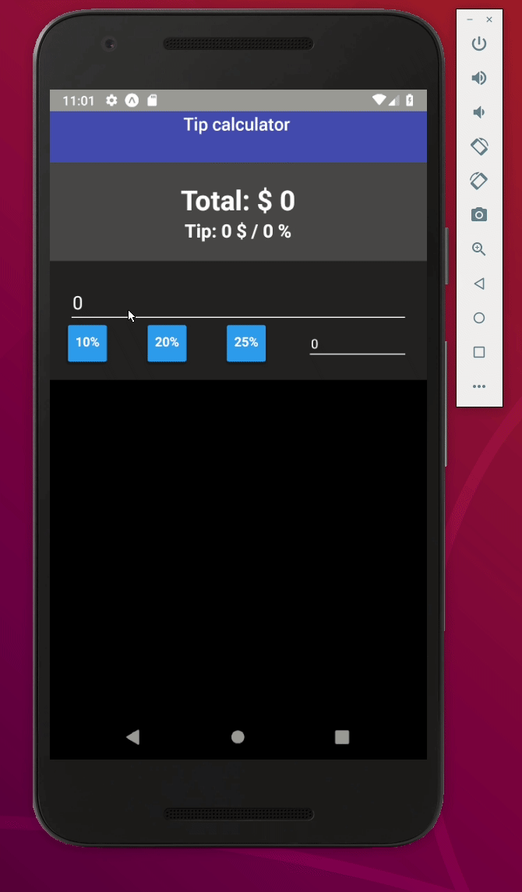

# TipCalc - Simple App for calculating tips

#### React-Native with GraphQl and Expo
* [expo](https://expo.io/@astronnomos/tipcalculator)
* [build within this repo](build)



### My notes:
**styles**
  * 'flex' is described in 'ratio'
  * 'width' is described in px as long as it in number. For % write it as string '23%'
  * react-native Platform for specific styles in component
  * Header can't by styled - wrapp in View


**diff OS**
  * naming convention .android.js, .ios.js - keep diff files for diff os
  * platform checks: 
  ```
     if (Platform.OS === 'ios') {
        console.log('ios');
     } else if (Platform.android === 'android') {
        console.log('android');
     }
  ```
